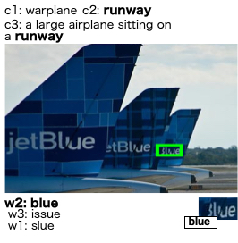
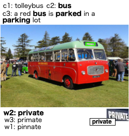

## Additional example

<pre>
Test set input .. 
spotted word, caption (this example)  
</pre>

<pre>
 <b>bold</b> font is the overlap information (c2) ..,<b>object (c1)</b> ... <b>caption (c3)</b> 
</pre>

<pre>
<b>w2</b>, 0.27474344, blue, a larage airplane sitting on a runway
w3, 0.00008864701, issue, a larage airplane sitting on a runway 
w1, 0.000012561679 ,slue, a larage airplane sitting on a runway 
</pre>

<pre>
<b>w2</b>,0.53307146, private, a red bus is parked in a parking lot  
w3, 0.39931786 ,primate, a red bus is parked in a parking lot  
w1, 0.000040993094, pinnate, a red bus is parked in a parking lot  
</pre>

<pre>
<b>w2</b>, 0.012142479, program, a train this is moving on the side of a road   
w1, 0.00032892823, brogan, a train this is moving on the side of a road  
w3, 0.00015427172 ,arrogant, a train this is moving on the side of a road   
</pre>

Note that, for best result, the baseline softmax score is needed to be * with this score and then re-ranked again.
